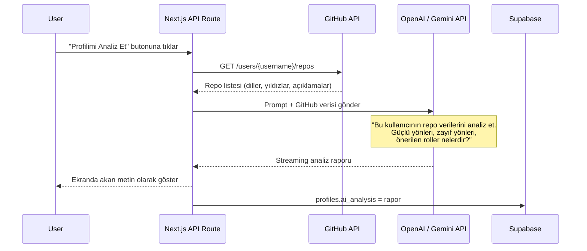

# Kivona: Senior Mühendis Yol Haritası (Next.js + Supabase)

**Seçilen Yığın**: Next.js (App Router) + Supabase + Tailwind CSS + Shadcn UI  
**Çalışma Modeli**: 5 kişi ortak ilerleme (rol ayrımı yok)  
**Süre**: ~3 hafta (13 Temmuz → 1 Ağustos civarı)  
**Felsefe**: "Her adımda çalışan bir şey olsun — yarım bırakılmış 10 özellik değil, bitmiş 5 özellik."

---

## 0. İlk Gün: Projenin İskeletini Kurun (Bugün Yapılmalı)

Bu adım herkesin aynı ortamda çalışmaya başlamasını sağlar. Bir kişi ekranını paylaşsın, diğerleri izlesin ve kendi bilgisayarlarında aynısını kursun.

### 0.1. Monorepo Oluşturma

Tek bir GitHub reposu açın. İçinde hem web uygulaması hem de ML mikroservisi ayrı klasörlerde yaşasın:

```
kivona/
├── apps/
│   └── web/                  ← Next.js uygulaması (ana proje)
│       ├── app/              ← App Router (sayfa rotaları)
│       │   ├── (auth)/       ← Giriş/kayıt sayfaları
│       │   ├── (dashboard)/  ← Korumalı sayfalar (giriş yapılmış)
│       │   │   ├── discover/ ← Yarışma İlan Panosu
│       │   │   ├── match/    ← Eşleştirme ekranı
│       │   │   ├── team/     ← Takım çalışma alanı
│       │   │   └── profile/  ← Kullanıcı profili
│       │   ├── api/          ← API Route'lar (server-side)
│       │   ├── layout.tsx
│       │   └── page.tsx      ← Landing page
│       ├── components/       ← Paylaşılan UI bileşenleri
│       │   ├── ui/           ← Shadcn bileşenleri (Button, Card, vb.)
│       │   └── shared/       ← Kendi yazdığınız bileşenler
│       ├── lib/              ← Yardımcı fonksiyonlar
│       │   ├── supabase/     ← Supabase client & server helpers
│       │   ├── github/       ← GitHub API çağrıları
│       │   └── ai/           ← OpenAI/Gemini API çağrıları
│       └── types/            ← TypeScript tipleri
│
├── services/
│   └── ml-api/               ← Python FastAPI Microservice
│       ├── app/
│       │   ├── main.py       ← FastAPI giriş noktası
│       │   ├── routers/      ← API endpoint'leri
│       │   ├── models/       ← ML modelleri & utils
│       │   └── scrapers/     ← Devpost/Kaggle kazıcılar
│       ├── requirements.txt
│       └── Dockerfile
│
├── docs/                     ← Proje dokümantasyonu
│   ├── db-schema.md
│   └── api-spec.md
├── .env.example              ← Env değişkenleri şablonu
├── .gitignore
└── README.md
```

### 0.2. Ortam Kurulumu (Herkes Yapmalı)

```bash
# 1. Repo'yu klonla
git clone https://github.com/<org>/kivona.git && cd kivona

# 2. Next.js projesini oluştur
cd apps/web
npx -y create-next-app@latest ./ --typescript --tailwind --eslint --app --src-dir=false --import-alias="@/*" --use-npm

# 3. Shadcn UI kur
npx -y shadcn@latest init

# 4. Temel Shadcn bileşenlerini ekle
npx -y shadcn@latest add button card input badge avatar tabs dialog sheet separator

# 5. Supabase ve AI kütüphanelerini kur
npm install @supabase/supabase-js @supabase/ssr ai @ai-sdk/openai

# 6. Python tarafı (ML ekibi)
cd ../../services/ml-api
python -m venv venv
pip install fastapi uvicorn sentence-transformers scikit-learn requests beautifulsoup4
```

### 0.3. Supabase Projesi ve GitHub OAuth

1. [supabase.com](https://supabase.com) → New Project oluşturun.
2. Authentication → Providers → **GitHub** → Enable.
3. GitHub Developer Settings'den OAuth App oluşturup `Client ID` ve `Client Secret`'ı Supabase'e girin.
4. `.env.local` dosyasına Supabase URL ve Anon Key'i ekleyin.

### 0.4. Git Branch Stratejisi

```
main          ← Sadece çalışan, deploy edilebilir kod
└── develop   ← Herkesin merge ettiği geliştirme dalı
    ├── feat/auth-github
    ├── feat/landing-page
    ├── feat/discover-board
    └── feat/ml-matching
```

> [!IMPORTANT]
> **Altın Kural**: Hiçbir zaman doğrudan `main`'e push yapmayın. Her özellik bir branch'te geliştirilir, Pull Request ile `develop`'a merge edilir. Hafta sonlarında `develop` → `main` merge edilir.

---

## 1. Sprint 1 (Gün 1–7): Temeller — "Giriş yap, profilini gör"

**Bu sprint sonunda çalışan MVP**: Kullanıcı GitHub ile giriş yapar, profil kartını görür, ilan panosuna göz atar.

### Veritabanı Şeması (Supabase SQL Editor'da çalıştırın)

```sql
-- Kullanıcılar (auth.users tablosunu genişletir)
CREATE TABLE public.profiles (
  id UUID PRIMARY KEY REFERENCES auth.users(id) ON DELETE CASCADE,
  username TEXT UNIQUE,
  full_name TEXT,
  avatar_url TEXT,
  bio TEXT,
  github_username TEXT,
  github_data JSONB,        -- GitHub API'den gelen ham veri
  skills TEXT[],             -- ['Python', 'React', 'ML']
  role TEXT,                 -- 'developer', 'designer', 'data_scientist'
  looking_for TEXT[],        -- Aradığı takım arkadaşı rolleri
  ai_analysis JSONB,        -- AI yetkinlik raporu
  created_at TIMESTAMPTZ DEFAULT NOW()
);

-- Yarışma İlanları
CREATE TABLE public.competitions (
  id UUID PRIMARY KEY DEFAULT gen_random_uuid(),
  title TEXT NOT NULL,
  platform TEXT,             -- 'devpost', 'kaggle', 'hackerearth'
  url TEXT,
  description TEXT,
  category TEXT,             -- 'ai_ml', 'web', 'mobile', 'data'
  prize TEXT,
  deadline TIMESTAMPTZ,
  image_url TEXT,
  created_at TIMESTAMPTZ DEFAULT NOW()
);

-- Takımlar
CREATE TABLE public.teams (
  id UUID PRIMARY KEY DEFAULT gen_random_uuid(),
  name TEXT NOT NULL,
  description TEXT,
  competition_id UUID REFERENCES public.competitions(id),
  created_by UUID REFERENCES public.profiles(id),
  max_members INT DEFAULT 5,
  created_at TIMESTAMPTZ DEFAULT NOW()
);

-- Takım Üyelikleri
CREATE TABLE public.team_members (
  id UUID PRIMARY KEY DEFAULT gen_random_uuid(),
  team_id UUID REFERENCES public.teams(id) ON DELETE CASCADE,
  user_id UUID REFERENCES public.profiles(id) ON DELETE CASCADE,
  role TEXT,                 -- Takımdaki rolü
  joined_at TIMESTAMPTZ DEFAULT NOW(),
  UNIQUE(team_id, user_id)
);

-- Fikir Havuzu (Takım Workspace)
CREATE TABLE public.ideas (
  id UUID PRIMARY KEY DEFAULT gen_random_uuid(),
  team_id UUID REFERENCES public.teams(id) ON DELETE CASCADE,
  author_id UUID REFERENCES public.profiles(id),
  title TEXT NOT NULL,
  content TEXT,
  votes INT DEFAULT 0,
  created_at TIMESTAMPTZ DEFAULT NOW()
);

-- Buz Kırıcı Cevapları
CREATE TABLE public.icebreaker_responses (
  id UUID PRIMARY KEY DEFAULT gen_random_uuid(),
  team_id UUID REFERENCES public.teams(id) ON DELETE CASCADE,
  user_id UUID REFERENCES public.profiles(id),
  question TEXT NOT NULL,
  answer TEXT NOT NULL,
  created_at TIMESTAMPTZ DEFAULT NOW()
);

-- RLS (Row Level Security) Politikaları
ALTER TABLE public.profiles ENABLE ROW LEVEL SECURITY;
ALTER TABLE public.teams ENABLE ROW LEVEL SECURITY;
ALTER TABLE public.team_members ENABLE ROW LEVEL SECURITY;
ALTER TABLE public.ideas ENABLE ROW LEVEL SECURITY;
ALTER TABLE public.competitions ENABLE ROW LEVEL SECURITY;

-- Herkes profilleri okuyabilir, sadece kendisi düzenleyebilir
CREATE POLICY "Profiles are viewable by everyone" ON public.profiles FOR SELECT USING (true);
CREATE POLICY "Users can update own profile" ON public.profiles FOR UPDATE USING (auth.uid() = id);
CREATE POLICY "Users can insert own profile" ON public.profiles FOR INSERT WITH CHECK (auth.uid() = id);

-- Yarışmalar herkes görebilir
CREATE POLICY "Competitions are viewable by everyone" ON public.competitions FOR SELECT USING (true);
```

### Sprint 1 İş Kırılımı (5 kişi ortak çalışma)

| # | Görev | Tahmini Süre | Çalışma Şekli |
|---|-------|-------------|---------------|
| 1 | Repo oluştur, Next.js + Supabase + Shadcn kur | 2 saat | **Mob Programming** (1 kişi yazar, 4 izler) |
| 2 | Supabase GitHub OAuth + middleware (korumalı rotalar) | 3 saat | **Pair** (2 kişi auth, 3 kişi UI) |
| 3 | Veritabanı şemasını SQL Editor'da oluştur, RLS politikaları | 2 saat | Pair |
| 4 | Landing Page (hero section, özellik kartları, CTA butonu) | 4 saat | **3 kişi** (1 tasarım, 2 kodlama) |
| 5 | Dashboard layout (sidebar + üst menü) | 3 saat | Pair |
| 6 | Profil kartı (GitHub verileriyle dolan) | 4 saat | Pair |
| 7 | İlan Panosu sayfası (statik/seed verilerle) | 4 saat | Pair |
| 8 | Python FastAPI boilerplate + GitHub API istemcisi | 4 saat | **ML ekibi** (2 kişi) |

> [!TIP]
> **"Mob Programming" Nedir?** Ekip topluca bir ekranın başında oturur, bir kişi (driver) kodu yazar, diğerleri yönlendirir. İlk kurulumda en az 1 saat böyle çalışmanız herkesin projeyi anlamasını sağlar.

### Sprint 1 Sonunda Beklenen Demo

```
✅ Kullanıcı /login'e gider → "GitHub ile Giriş Yap" butonuna tıklar
✅ GitHub yetkilendirmesi tamamlanır, /dashboard'a yönlendirilir
✅ Sol menüde: Keşfet, Eşleşme, Takımım, Profilim linkleri
✅ /discover sayfasında 10-15 statik hackathon ilanı kart olarak listelenir
✅ /profile sayfasında GitHub'dan çekilen avatar, username ve repo listesi görünür
```

---

## 2. Sprint 2 (Gün 8–14): Akıl — "AI analiz etsin, eşleştirelim"

**Bu sprint sonunda çalışan MVP**: AI profil raporu oluşur, eşleştirme çalışır, takım kurulur, buz kırıcı kartlar belirir.

### Sprint 2 İş Kırılımı

| # | Görev | Tahmini Süre | Detay |
|---|-------|-------------|-------|
| 1 | GitHub API → repo verilerini çek, `profiles.github_data`'ya yaz | 4 saat | `lib/github/` altında |
| 2 | AI Skill Analysis: GitHub verisini OpenAI API'ye gönder, rapor üret | 5 saat | `lib/ai/skill-analysis.ts` |
| 3 | Profil sayfasına AI rapor bölümü ekle (streaming text) | 3 saat | Vercel AI SDK + `useChat` |
| 4 | Eşleştirme ekranı: diğer kullanıcıları listele, filtrele | 4 saat | `/match` sayfası |
| 5 | ML Microservice: Embedding + Cosine Similarity eşleştirme endpoint'i | 6 saat | FastAPI `/api/match` |
| 6 | Takım oluşturma + davet + üye kabul akışı | 5 saat | DB + UI |
| 7 | Buz Kırıcı kartları (takım kurulunca tetiklenir) | 3 saat | Hazır soru havuzu + kart UI |
| 8 | Takım Workspace: Basit Kanban (Todo/Doing/Done) | 5 saat | Drag-and-drop (dnd-kit) |

### AI Skill Analysis — Nasıl Çalışır?

Bu, projenin jüriyi en çok etkileyecek kısmıdır. Akış şu şekildedir:



**Örnek Prompt** (`lib/ai/skill-analysis.ts`):

```typescript
const systemPrompt = `Sen bir teknik yetenek analistisin. 
Kullanıcının GitHub repo verilerini analiz ederek:
1. En güçlü 3 teknik alanını belirle (örn: Frontend, Backend, ML)
2. Kullandığı dillerin dağılımını yüzdelik olarak çıkar
3. Hackathon ekiplerinde hangi role en uygun olduğunu öner
4. Geliştirmesi gereken 2 alanı belirt
Yanıtını Türkçe, profesyonel ama samimi bir dilde ver.`;

const userPrompt = `
Kullanıcı: ${username}
Toplam Repo: ${repos.length}
Dil Dağılımı: ${JSON.stringify(languageStats)}
En Popüler Repolar: ${topRepos.map(r => `${r.name} (${r.language}, ⭐${r.stars}): ${r.description}`).join('\n')}
Son 6 Ay Aktivitesi: ${recentActivity}
`;
```

### Eşleştirme Motoru — 2 Katmanlı Mimari

```
Katman 1 (Hızlı Filtre — Next.js):
  → Rol bazlı filtreleme (Backend arıyorum → Backend geliştiricileri listele)
  → Konum/dil filtresi

Katman 2 (Akıllı Skor — ML Microservice):
  → Kullanıcının skills[] vektörü ↔ Takımın ihtiyaç vektörü
  → Cosine Similarity → %87 Uyumlu
  → FastAPI endpoint: POST /api/match {user_skills, team_needs} → {score, explanation}
```

### Sprint 2 Sonunda Beklenen Demo

```
✅ Kullanıcı profilinde "AI ile Analiz Et" butonuna tıklar
✅ Ekranda akan yazıyla "Güçlü yönleriniz: React, Node.js..." raporu belirir
✅ /match sayfasında diğer kullanıcılar kart olarak listelenir (uyum skoru ile)
✅ "Takım Kur" butonu → takım oluşturulur, üyeler davet edilir
✅ Takım kurulduğunda Buz Kırıcı kartlar ekrana gelir
✅ /team sayfasında basit bir Kanban panosu (sürükle-bırak) çalışır
```

---

## 3. Sprint 3 (Gün 15–20): Cila ve Sahneye Çıkış — "WOW dedirt, yayınla"

**Bu sprint sonunda**: Proje Vercel'de canlı, demo videosu çekilmiş, sunum hazır.

### Sprint 3 İş Kırılımı

| # | Görev | Tahmini Süre | Detay |
|---|-------|-------------|-------|
| 1 | AI Takım Analizi (takım kurulunca güçlü/zayıf yön analizi) | 4 saat | Üye 3-4 |
| 2 | Tasarım cilası: Dark mode, glassmorphism, mikro animasyonlar | 5 saat | Tüm ekip |
| 3 | Responsive kontrol (mobil, tablet, masaüstü) | 3 saat | - |
| 4 | Loading state'ler, skeleton UI, error boundary'ler | 3 saat | UX kalitesi |
| 5 | Vercel'e deploy (web) + Render/HuggingFace'e deploy (ML) | 2 saat | - |
| 6 | Seed data: 20+ gerçekçi ilan, 10+ sahte profil | 2 saat | Demo için |
| 7 | README.md mükemmelleştirme (gif, mimari diyagram, kurulum) | 3 saat | - |
| 8 | Demo videosu çekimi (2-3 dakika, voiceover) | 3 saat | - |
| 9 | Pitch deck (10 slayt) hazırlama ve prova | 3 saat | - |

### Tasarım Cilası Kontrol Listesi

```
□ Dark mode varsayılan olmalı (Shadcn dark teması)
□ Landing page'de hero section animasyonu (framer-motion)
□ Kart hover efektleri (scale + glow border)
□ Profil kartında glassmorphism (backdrop-blur + border)
□ AI analiz çıktısında streaming yazı efekti (typewriter)
□ Eşleşme skoru halka grafiği (animasyonlu, recharts)
□ Page transition'lar (framer-motion AnimatePresence)
□ Skeleton loader'lar (Shadcn Skeleton bileşeni)
□ Favicon ve meta taglar (SEO)
□ 404 ve error sayfaları tasarımı
```

### Sprint 3 Sonunda Beklenen Demo (Jüri Senaryosu)

```
1. Jüri kivona.vercel.app'i açar → Premium dark landing page
2. "GitHub ile Giriş Yap" → 2 saniyede dashboard'a gelir
3. "Profilimi Analiz Et" → AI streaming rapor çıkar (WOW anı!)
4. "Eşleşme" sayfası → Uyumlu kullanıcılar %87, %72 skorlarıyla listelenir
5. "Takım Kur" → Buz Kırıcı kartlar belirir, eğlenceli sorular
6. Takım çalışma alanı → Kanban panosu, fikir havuzu çalışır
7. "Keşfet" → Güncel hackathon ilanları kategorilere ayrılmış şekilde listelenir
```

---

## 4. "Ortak İlerleme" Modeli İçin Pratik Tavsiyeler

Rol dağılımı yapmadan 5 kişi verimli çalışmak zordur ama imkansız değildir. Bunu başarmak için:

### 4.1. Günlük Standup (15 dakika, her gün)
Her gün sabit bir saatte (örn: 10:00) herkes 3 soruyu yanıtlar:
1. Dün ne yaptım?
2. Bugün ne yapacağım?
3. Takıldığım bir yer var mı?

### 4.2. Pair/Mob Programming Kuralları
- **Haftanın ilk 2 günü**: Mob Programming (5 kişi bir ekranda, kurulum ve mimari kararlar)
- **Geri kalan günler**: Pair Programming (2+2+1 veya 2+3 şeklinde görev bazlı eşleşme)
- **Pair'ler her 2 günde değişsin**: Herkes her kod parçasını tanısın

### 4.3. İletişim Disiplini
- **Discord/Slack kanalı**: `#general`, `#frontend`, `#backend-ml`, `#bugs`
- **PR kuralı**: Her PR'a en az 1 kişi review yapsın (10 dakikayı geçmemeli)
- **Günlük deploy**: `develop` branch'i her gün Vercel preview'a deploy edilsin

### 4.4. "Definition of Done" (Bitiş Tanımı)
Bir görev ancak şu koşullar sağlanırsa "bitti" sayılır:
- [ ] Kod çalışıyor (hata yok)
- [ ] Mobilde de düzgün görünüyor
- [ ] Loading ve error durumları ele alınmış
- [ ] En az 1 kişi kodu review etmiş
- [ ] `develop` branch'ine merge edilmiş

---

## 5. Kritik Riskler ve Önlemler

| Risk | Olasılık | Etki | Önlem |
|------|---------|------|-------|
| Supabase GitHub OAuth çalışmazsa | Düşük | Yüksek | İlk gün test edin. Yedek: email/password auth |
| OpenAI API kotası biterse | Orta | Orta | Gemini API'ye geçiş hazırlığı yapın. `.env`'de provider değişkeni tutun |
| ML Microservice deploy edilemezse | Orta | Orta | Tüm ML mantığını Next.js API Route'lara taşıyabilirsiniz (yedek plan) |
| Zaman yetmezse | Yüksek | Yüksek | Kanban panosunu ve rozet sistemini ilk elenecek özellikler olarak işaretleyin |
| Git merge çakışmaları | Yüksek | Düşük | Küçük ve sık commit'ler atın, büyük PR'lar açmayın |

---

## 6. Haftalık Kontrol Noktaları (Milestone Checklist)

### ✅ Hafta 1 Sonu Kontrol
- [ ] GitHub OAuth ile giriş çalışıyor mu?
- [ ] Profil sayfası GitHub verisiyle doluyor mu?
- [ ] İlan panosu 10+ ilanla görünüyor mu?
- [ ] Dashboard layout (sidebar + routing) çalışıyor mu?
- [ ] FastAPI boilerplate ayakta mı?
- [ ] Vercel preview deploy çalışıyor mu?

### ✅ Hafta 2 Sonu Kontrol
- [ ] AI Skill Analysis raporu streaming olarak çalışıyor mu?
- [ ] Eşleştirme sayfasında kullanıcılar skor ile listeleniyor mu?
- [ ] Takım oluşturma ve üye ekleme çalışıyor mu?
- [ ] Buz Kırıcı kartlar takım kurulunca tetikleniyor mu?
- [ ] Kanban panosu sürükle-bırakla çalışıyor mu?

### ✅ Hafta 3 Sonu Kontrol
- [ ] Proje kivona.vercel.app'te canlı mı?
- [ ] ML servisi Render/HuggingFace'te canlı mı?
- [ ] Dark mode ve animasyonlar düzgün çalışıyor mu?
- [ ] Demo videosu çekildi mi?
- [ ] README.md hazır mı?
- [ ] Pitch deck hazır mı?

---

## 7. Sonuç: Bu Projeyi 3 Haftada Nasıl Bitirirsiniz?

Bir senior mühendis olarak şunu söyleyebilirim: **başarının %80'i teknik değil, disiplindir.**

1. **İlk 3 gün her şeyi belirler.** Proje iskeleti, auth ve database ilk 3 günde çalışır halde olmalıdır. Bu olmazsa 2. hafta panik başlar.
2. **Her akşam `develop`'a merge edin.** "Yarın yaparım" demeyin. Çalışan her küçük parçayı birleştirin.
3. **AI özelliği projenizin kalbidir.** Jüri "güzel bir Trello klonu" görmek istemiyor. AI'ın gerçekten anlamlı bir şey yapması (GitHub profili analiz etmesi, eşleştirme skoru hesaplaması) projeyi öne çıkaracak tek şeydir.
4. **Son 3 günü sadece cilaya ayırın.** Yeni özellik eklemeyi Gün 17'de durdurun. Kalan sürede sadece UI parlatma, video çekimi ve sunum hazırlığı yapın.
5. **"Çalışıyor ama çirkin" kabul edilemez.** Glassmorphism, dark mode, hover animasyonları gibi detaylar ilk izlenimi yapar. Jüri projeyi 5 saniyede yargılar.

> [!CAUTION]
> **En Büyük Hata**: "Hepsini yapalım" demek. Rozet sistemi, gerçek zamanlı sohbet, canlı scraping gibi özellikleri bu sürede bitirmek imkansızdır. Bunları ekleyin ama **sadece sunumda "gelecek planları" olarak gösterin**, kodlamaya çalışmayın.
